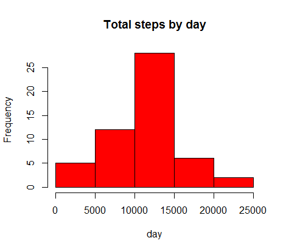
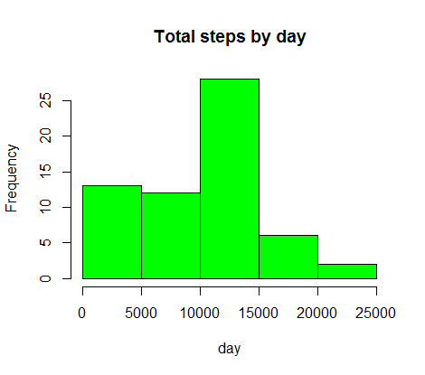
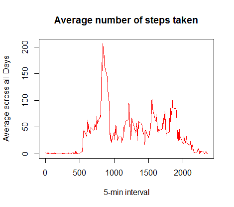
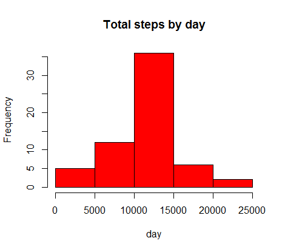
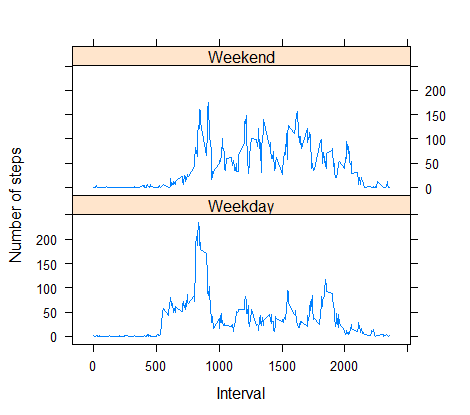

```{r setup, include=FALSE}
knitr::opts_chunk$set(echo = TRUE)
```

## R Markdown

# Loading and preprocessing the data

Read the data file in.
```{r readfile}
activity <- read.csv("activity.csv", colClasses = c("numeric", "character", "numeric"))
head(activity)
activity$date <- as.Date(activity$date, "%Y-%m-%d")

```

Sum the number of steps per day
```{r summarize/day}
StepsTotal <- aggregate(steps ~ date, data = activity, sum, na.rm = TRUE)

hist(StepsTotal$steps, main = "Total steps by day", xlab = "day", col = "red")
```


And the mean and median is
```{r mean and median}
mean(StepsTotal$steps)
## [1] 10766
median(StepsTotal$steps)
## [1] 10765
```

The second approach is to make a data frame first with the values that I need I create a data frame with the days and the total of steps by day
```{r day/steps}
steps <- rep(NA, 61)
day <- rep("NA", 61)
stepsday <- tapply(activity$steps, activity$date, sum, na.rm = T)
length(stepsday)
## [1] 61
```

Create a histogram of the results
```{r histogram}
for (i in 1:61) {
  steps[i] <- stepsday[[i]]
  day[i] <- names(stepsday)[i]
}

df <- data.frame(day, steps)
head(df)

hist(df$steps, main = "Total steps by day", xlab = "day", col = "green")
```
 

# What is the mean total number of steps taken per day?
Calculate the mean of the steps per day
```{r means_steps/day}
mean(StepsTotal$steps)
## [1] 10766
```
Calculate the median of the steps per day
```{r median_steps/day}
median(StepsTotal$steps)
## [1] 10765
```

# What is the average daily activity pattern?

Get the average steps per 5 minute interval
```{r avg_5_min}
time_series <- tapply(activity$steps, activity$interval, mean, na.rm = TRUE)
```
Plot steps against time interval, averaged across all days
```{r plot_interval}
plot(row.names(time_series), time_series, type = "l", xlab = "5-min interval", 
     ylab = "Average across all Days", main = "Average number of steps taken", 
     col = "red")
```
 

On average, which interval during the day has the most steps.
```{r max_interval}
max_interval <- which.max(time_series)
names(max_interval)
## [1] "835"
```

# Imputing missing values

How many NAs are there in the original table?
```{r NAs}
activity_NA <- sum(is.na(activity))
activity_NA
## [1] 2304
```

Merge 5 minute interval with original steps table
```{r merge}
StepsAverage <- aggregate(steps ~ interval, data = activity, FUN = mean)
fillNA <- numeric()
```

Replace NA values with mean of steps values for that time interval
```{r replace_na}
  for (i in 1:nrow(activity)) {
  obs <- activity[i, ]
  if (is.na(obs$steps)) {
    steps <- subset(StepsAverage, interval == obs$interval)$steps
  } else {
    steps <- obs$steps
  }
  fillNA <- c(fillNA, steps)
}
```

Create a histogram of the results
```{r new_hist}
new_activity <- activity
new_activity$steps <- fillNA

StepsTotal2 <- aggregate(steps ~ date, data = new_activity, sum, na.rm = TRUE)
hist(StepsTotal2$steps, main = "Total steps by day", xlab = "day", col = "red")
```
 

It looks like the imputing of NA values increases the middle bar (mean/median) height, but other bars seem unchanged.


Calculate the new mean of the steps per day
```{r new_means_steps/day}
mean(StepsTotal2$steps)
## [1] 10766.19
```
Calculate the new median of the steps per day
```{r new_median_steps/day}
median(StepsTotal2$steps)
## [1] 10766.19
```

It looks like the mean did not change, but the median took on the value of the mean, now that some non-integer values were plugged in. 


# Are there differences in activity patterns between weekdays and weekends?
Regenerate steps_filled, and flag whether a date is a weekend or a weekday.
Convert resulting column to factor.
```{r fill_weekdays}
day <- weekdays(activity$date)
daylevel <- vector()
for (i in 1:nrow(activity)) {
  if (day[i] == "Saturday") {
    daylevel[i] <- "Weekend"
  } else if (day[i] == "Sunday") {
    daylevel[i] <- "Weekend"
  } else {
    daylevel[i] <- "Weekday"
  }
}
activity$daylevel <- daylevel
activity$daylevel <- factor(activity$daylevel)
```

Get average steps per interval and day_type
```{r plot_interva_day_type}
stepsByDay <- aggregate(steps ~ interval + daylevel, data = activity, mean)
names(stepsByDay) <- c("interval", "daylevel", "steps")
```

Plot the weekend and weekday results in a panel plot.
```{r day_type_plot}
```
 
